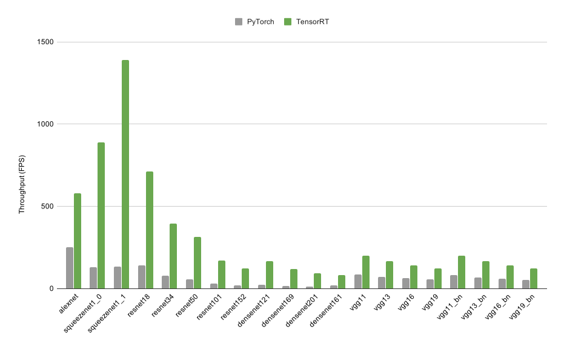

# torch2trt

 

torch2trt is a PyTorch to TensorRT converter which utilizes the 
TensorRT Python API.  The converter is

* Easy to use - Convert modules with a single function call ``torch2trt``

* Easy to extend - Write your own layer converter in Python and register it with ``@tensorrt_converter``

If you find an issue, please [let us know](https://github.com/NVIDIA-AI-IOT/torch2trt/issues)!